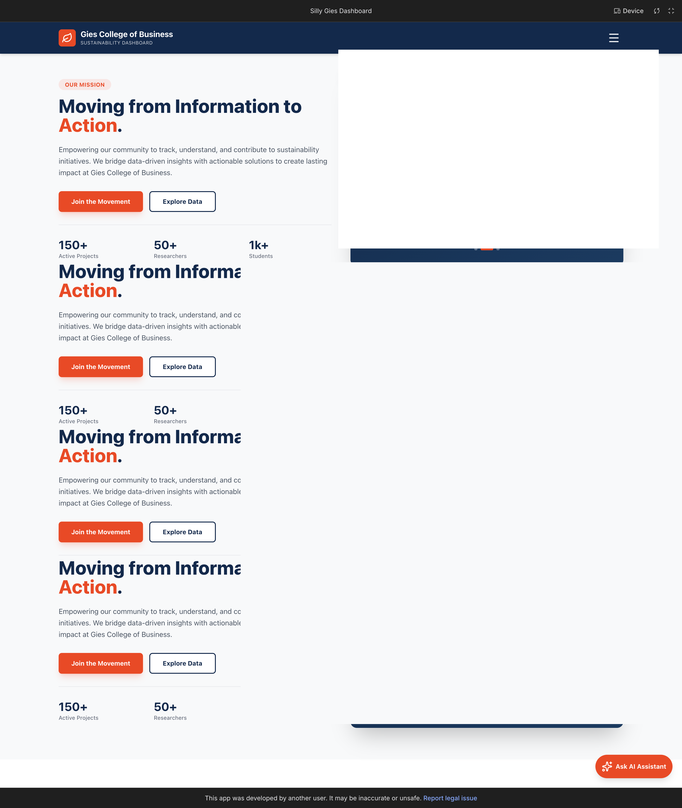

# The Illinois Sustainability Impact Engine

> **A comprehensive decision-support platform transforming fragmented sustainability research into actionable insights for researchers, faculty, and leadership.**

---

<div align="center">



**Connecting Research. Driving Impact. Advancing Sustainability.**

[🌐 AI Prototype](https://aistudio.google.com/apps/drive/1nOrHvvhmT6JiSS_uvIfVkTRNFIb07NbI?showPreview=true&showAssistant=true) • [💡 Impact Engine](https://prattkk11.github.io/sustainability-dashboard/) • [🤝 Collaboration Hub](components/collab_hub/) • [📊 Presentation](presentation/Case%20Comp.pdf)

</div>

---

## 🎯 The Challenge

Universities generate extensive sustainability-related research, but this work is often **fragmented across departments, disciplines, and individuals**, creating critical barriers:

| **Problem** | **Impact** |
|----------------|---------------|
| Limited visibility into existing sustainability expertise | Missed collaboration opportunities across departments |
| Difficulty identifying collaborators with complementary skills | Reduced innovation potential and slower research formation |
| Lack of structured insights into SDG coverage and gaps | Inefficient resource allocation and strategic planning |
| Manual, time-intensive processes for finding partners | Slowed interdisciplinary team formation |

**Result**: Opportunities for impactful sustainability research and strategic initiatives are frequently missed.

---

## Our Solution

The **Illinois Sustainability Impact Engine** is a **5-component integrated platform** that transforms how universities discover, connect, and leverage sustainability research expertise.

### Platform Architecture

The Illinois Sustainability Impact Engine integrates **5 components** that work together to transform sustainability research discovery and collaboration:

<div align="center">

| Component | Technology | Status |
|-----------|------------|--------|
| **AI Prototype** | Google AI Studio | Live |
| **Impact Engine** | Web Dashboard | Live |
| **Sustainability Dashboard** | Power BI | Integrated |
| **Research Coverage Analysis** | Power BI | Integrated |
| **Collaboration Hub** | Streamlit | Live |

</div>

**Integration Flow**:
```
Publications Data (publications.csv)
         │
         ├──→ AI Prototype (Natural Language Queries)
         │
         ├──→ Impact Engine (Research Impact Metrics)
         │
         ├──→ Sustainability Dashboard (SDG Overview)
         │
         ├──→ Research Coverage Analysis (Gap Analysis)
         │
         └──→ Collaboration Hub (Compatibility Matching)
```

Each component addresses specific challenges while sharing the same data foundation, enabling a comprehensive view of sustainability research across the institution.

---

## Platform Components

### 1. AI Prototype
**Natural Language Query Interface**

[**Try It Now**](https://aistudio.google.com/apps/drive/1nOrHvvhmT6JiSS_uvIfVkTRNFIb07NbI?showPreview=true&showAssistant=true)

**Addresses**: Limited visibility and manual discovery processes

**What it does**:
- Ask questions about sustainability research in **plain language**
- Get instant answers about research expertise, SDG coverage, and collaboration opportunities
- Explore the research landscape through conversational interface
- Powered by Google AI Studio for intelligent query understanding

**Example queries**:
- *"Who is researching climate change adaptation in the engineering department?"*
- *"What SDGs have the least research coverage?"*
- *"Find researchers working on renewable energy with experimental methods"*

---

### 2. Sustainability Dashboard
**High-Level Research Visualization**

**Addresses**: Lack of structured insights into SDG coverage

**What it does**:
- Visualizes research activity across all **17 UN SDGs**
- Identifies research strengths and gaps at a glance
- Provides strategic planning support for leadership
- Tracks trends and patterns over time

**Status**: Integrated in Power BI platform

---

### 3. Research Coverage Analysis
**Detailed Distribution & Gap Analysis**

**Addresses**: Inefficient resource allocation

**What it does**:
- Analyzes research distribution across departments and SDGs
- Identifies areas of strength and opportunities for growth
- Department-level SDG coverage breakdown
- Trend visualization to inform strategic funding decisions

**Status**: Integrated in Power BI platform

---

### 4. Impact Engine
**Research Impact Metrics & Sustainability Dashboard**

[**View Live Dashboard**](https://prattkk11.github.io/sustainability-dashboard/)

**Addresses**: Difficulty quantifying research value and lack of strategic insights

**What it does**:
- Quantifies research impact beyond publication count
- Calculates impact scores (journal tier, SDG alignment, recency)
- Enables researcher and department impact comparisons
- Visualizes sustainability outcomes and contributions
- Interactive web dashboard for exploring sustainability research

**Status**: Live web application

---

### 5. Collaboration Hub
**Smart Compatibility Matching**

**Addresses**: Difficulty identifying collaborators with complementary skills

**What it does**:
- **NLP-powered semantic analysis** to match research topics
- **Rewards complementary methods** (e.g., Theoretical + Empirical) rather than just similarity
- **Three stakeholder paths**: Faculty (collaborator matching), Students (opportunities), Donors (funding priorities)
- **Transparent scoring**: Every recommendation is explainable

**Key Innovation**: The system actively rewards **methodological complementarity**, driving innovation by bringing together different research perspectives.

**Scoring Formula**:
```
CCS = (Topic × 45%) + (Method × 40%) + (Career × 15%)
```

**Status**: Live Streamlit web application

**[View Full Documentation →](components/collab_hub/)**

---

## How We Address the Problem

### Problem 1: Limited Visibility → **AI Prototype + Sustainability Dashboard**
- **AI Prototype**: Natural language queries instantly surface relevant researchers and expertise
- **Sustainability Dashboard**: Visual overview of all sustainability research activity

### Problem 2: Difficulty Finding Collaborators → **Collaboration Hub**
- **NLP semantic matching**: Finds researchers with aligned topics
- **Method complementarity**: Matches researchers with complementary skills (key innovation)
- **Career stage optimization**: Facilitates mentorship and peer collaboration

### Problem 3: Lack of Strategic Insights → **Research Coverage Analysis + Impact Engine**
- **Coverage Analysis**: Identifies gaps and strengths across SDGs
- **Impact Engine**: Quantifies research value to inform resource allocation

### Problem 4: Manual Processes → **All Components Working Together**
- **AI Prototype**: Conversational discovery replaces manual searching
- **Collaboration Hub**: Automated matching replaces manual partner identification
- **Dashboards**: Real-time insights replace manual data compilation

---

## Quick Start

### For Judges & Reviewers

1. **Start Here**: This README provides the complete platform overview
2. **Try the AI Prototype**: [Click here to explore](https://aistudio.google.com/apps/drive/1nOrHvvhmT6JiSS_uvIfVkTRNFIb07NbI?showPreview=true&showAssistant=true)
3. **Collaboration Hub**: See `components/collab_hub/` for detailed documentation and live app
4. **View Presentation**: See `presentation/Case Comp.pdf` for the complete submission

### For Developers

```bash
# Clone the repository
git clone https://github.com/meryemrafiq14-hue/sustainability_case_competition.git
cd sustainability_case_competition

# Run Collaboration Hub Streamlit app
cd components/collab_hub
pip install -r requirements.txt
streamlit run app.py
```

---

## Technical Implementation

### Technology Stack

| Component | Technology | Purpose |
|-----------|------------|---------|
| **AI Prototype** | Google AI Studio | Natural language query interface |
| **Impact Engine** | Web Dashboard | Research impact metrics and visualization |
| **Sustainability Dashboard** | Power BI | Data visualization and analytics |
| **Collaboration Hub** | Streamlit + Python | Interactive web application |
| **NLP** | sentence-transformers | Semantic similarity analysis |
| **Data Processing** | Pandas/NumPy | Data manipulation and analysis |

### Data Pipeline

```
Publications CSV (publications.csv)
    ↓
    ├──→ Power BI Dashboards (Sustainability, Coverage, Impact)
    ├──→ AI Prototype (Google AI Studio)
    └──→ Collaboration Hub (Streamlit App)
         ├── Build researcher profiles on-the-fly
         ├── Perform NLP semantic analysis
         └── Calculate compatibility scores in real-time
```

---

## Data & Methodology

### Data Source
- **Input**: Publications CSV (`publications.csv`) provided by the case competition
- **No external scraping**: All data comes from the provided dataset
- **Fields used**: Author names, departments, publication years, keywords, abstracts, SDG labels

### Methodology Transparency
- **Rule-based systems**: Transparent, explainable scoring (not black-box AI)
- **Real data only**: All analysis uses actual publication data
- **NLP semantic analysis**: Uses sentence-transformers on actual keywords and abstracts
- **Complete documentation**: Every component's methodology is fully documented

**See `components/collab_hub/docs/UNDER_THE_HOOD.md`** for complete technical details.

---

## Impact & Value

### Key Outcomes

| Outcome | Impact |
|---------|--------|
| **Visibility** | Improved visibility of sustainability expertise across the institution |
| **Efficiency** | Reduced friction in forming interdisciplinary research teams |
| **Strategy** | Data-driven decision making for leadership and donors |
| **Innovation** | Methodological complementarity drives cross-disciplinary breakthroughs |
| **Culture** | Shift from passive information access to proactive insight generation |

### Measurable Benefits

- **Discovery Time**: Reduced from hours to seconds (AI Prototype)
- **Match Quality**: Transparent scoring ensures explainable recommendations (Collaboration Hub)
- **Strategic Planning**: Clear visibility into research gaps and strengths (Dashboards)
- **Resource Allocation**: Impact metrics inform funding decisions (Impact Engine)

---

## Repository Structure

```
sustainability_case_competition/
├── README.md                          # This file (platform overview)
├── DATA_POLICY.md                     # Data confidentiality policy
├── publications.csv                   # Original data file
├── presentation/                      # Competition presentation
│   └── Case Comp.pdf
├── screenshots/                       # Platform screenshots
│   ├── Sustainability.png
│   ├── Impact_engine_pro.png
│   ├── research.png
│   └── collabration_hub.png
│
└── components/
    └── collab_hub/                   # Collaboration Hub component
        ├── README.md                 # Component overview
        ├── app.py                    # Main Streamlit application
        ├── requirements.txt          # Python dependencies
        ├── DEPLOYMENT_GUIDE.md       # Streamlit Cloud deployment
        └── docs/                     # Technical documentation
            ├── UNDER_THE_HOOD.md    # Complete technical deep dive
            ├── methodology.md        # Step-by-step methodology
            ├── limitations.md        # Known limitations
            └── QUICK_START_FOR_JUDGES.md
```

---

## Documentation

### Collaboration Hub
The Collaboration Hub is the only component with code in this repository. Complete documentation available in `components/collab_hub/`:

- **`README.md`** - Component overview and quick start
- **`docs/UNDER_THE_HOOD.md`** - Complete technical documentation (includes all Q&A)
- **`docs/methodology.md`** - Step-by-step methodology
- **`docs/limitations.md`** - Known limitations and future work
- **`DEPLOYMENT_GUIDE.md`** - Streamlit Cloud deployment guide

### Other Components
- **AI Prototype**: [Live on Google AI Studio](https://aistudio.google.com/apps/drive/1nOrHvvhmT6JiSS_uvIfVkTRNFIb07NbI?showPreview=true&showAssistant=true)
- **Impact Engine**: [Live Web Dashboard](https://prattkk11.github.io/sustainability-dashboard/)
- **Power BI Dashboards**: See presentation for screenshots and details

---

## Skills Demonstrated

### Technical Skills
- **AI/ML Integration**: Google AI Studio prototype development
- **Web Development**: Streamlit application development
- **NLP**: Semantic similarity analysis using sentence-transformers
- **Data Visualization**: Power BI dashboard creation
- **Data Analysis**: Statistical analysis and pattern recognition
- **Algorithm Design**: Multi-factor scoring system development

### Business & Analytical Skills
- **Problem Structuring**: Business analytics lens for complex problems
- **Stakeholder Analysis**: Multi-user persona design (Faculty, Students, Donors)
- **Decision Modeling**: Quantitative scoring framework development
- **Sustainability Analytics**: UN SDG mapping and analysis
- **Strategic Thinking**: Institutional impact assessment

---

## Future Work

### Planned Enhancements
1. **Integration**: Connect all 5 components into a unified platform
2. **Real-time Data**: Live publication and grant database integration
3. **Advanced Analytics**: Domain-specific NLP models, network analysis
4. **User Features**: Profiles, preferences, notification system
5. **Expansion**: Beyond sustainability to other research domains

---

## Disclaimer

This project is an academic case competition submission.  
No proprietary or confidential data was used.  
All data processing and analysis was performed on publicly available or anonymized university publication metadata.

---

## Contact & Links

- **[AI Prototype](https://aistudio.google.com/apps/drive/1nOrHvvhmT6JiSS_uvIfVkTRNFIb07NbI?showPreview=true&showAssistant=true)** - Try the natural language interface
- **[Impact Engine](https://prattkk11.github.io/sustainability-dashboard/)** - View research impact dashboard
- **[Collaboration Hub](components/collab_hub/)** - View Streamlit app documentation
- **[Presentation](presentation/Case%20Comp.pdf)** - Complete competition submission
- **Questions**: Reach out through GitHub Issues

---

<div align="center">

**Built for sustainable research collaboration**

_Illinois Sustainability Impact Engine - Case Competition 2025_

[AI Prototype](https://aistudio.google.com/apps/drive/1nOrHvvhmT6JiSS_uvIfVkTRNFIb07NbI?showPreview=true&showAssistant=true) • [Impact Engine](https://prattkk11.github.io/sustainability-dashboard/) • [Collaboration Hub](components/collab_hub/) • [Presentation](presentation/Case%20Comp.pdf)

</div>
